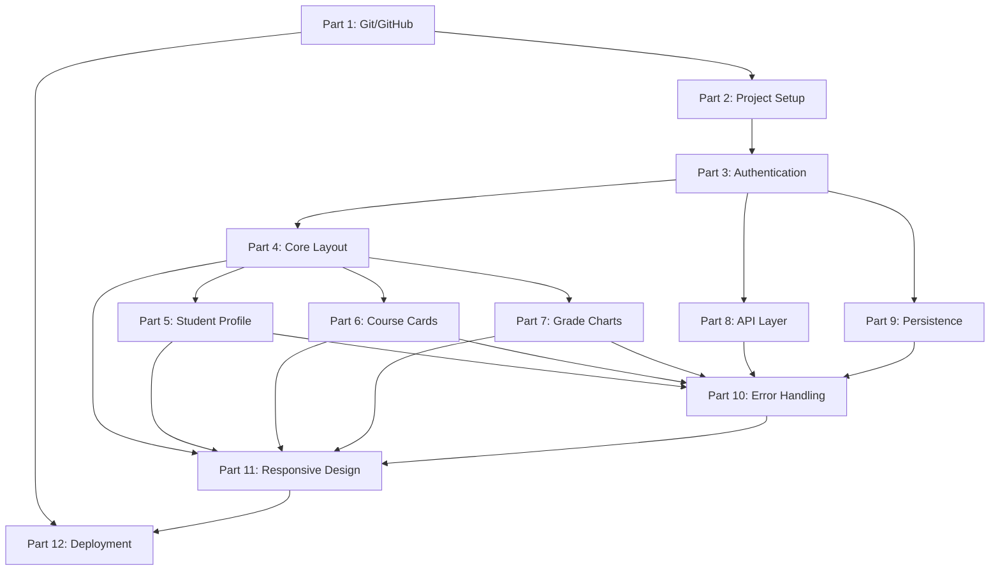

# Student Progress Tracking SaaS - Project Division & Architecture

**Document Version:** 1.0  
**Project:** Student Progress Tracking SaaS  
**Date:** 2024  
**Status:** Approved for Implementation

---

## 1. Project Division Overview

The project is divided into **12 distinct parts/modules**, each representing a self-contained area of functionality that can be developed, tested, and deployed independently. Git/GitHub Version Control is Part 1 as specified.

| Part | Module Name | Description | Estimated Effort | Dependencies |
|------|-------------|-------------|------------------|--------------|
| **Part 1** | **Git/GitHub & Version Control** | Repository setup, branching strategy, CI/CD pipeline, code review process | 1 week | — |
| **Part 2** | **Project Setup & Configuration** | Build tooling, linting, formatting, dev server, mock API, environment config | 1 week | Part 1 |
| **Part 3** | **Authentication Module** | Login, session management, protected routes, logout, token storage | 1.5 weeks | Part 2 |
| **Part 4** | **Core Layout & Navigation** | Responsive shell, header, sidebar, routing, mobile drawer | 1 week | Part 3 |
| **Part 5** | **Dashboard - Student Profile** | Profile card, overall progress, avatar, metadata display | 0.5 weeks | Part 4 |
| **Part 6** | **Dashboard - Course Progress Cards** | Course grid, progress bars, status badges, module counters | 1 week | Part 4 |
| **Part 7** | **Dashboard - Grade Visualizations** | Chart.js integration: bar, doughnut, line charts with responsiveness | 1.5 weeks | Part 4, Part 6 |
| **Part 8** | **API Integration Layer** | Centralized API service, interceptors, retry logic, loading states | 1 week | Part 3 |
| **Part 9** | **Data Persistence & State** | localStorage/sessionStorage abstraction, hydration, theme, filters | 0.5 weeks | Part 3 |
| **Part 10** | **Error Handling & UX Polish** | Toast system, skeleton loaders, empty states, retry, offline detection | 1 week | Part 5, 6, 7 |
| **Part 11** | **Responsive Design & Cross-Browser** | Breakpoint testing, touch targets, mobile nav, chart resize, a11y | 1 week | Part 4-10 |
| **Part 12** | **Deployment & Operations** | Production build, Vercel/Netlify config, monitoring, documentation | 0.5 weeks | Part 1, 11 |

---

## 2. Dependency Graph



---

## 3. Team Assignment Recommendations

| Role | Primary Parts | Secondary Parts |
|------|---------------|-----------------|
| **Tech Lead** | Part 1, Part 12 | All (reviews) |
| **Frontend Engineer 1** | Part 2, Part 3, Part 8 | Part 9 |
| **Frontend Engineer 2** | Part 4, Part 5, Part 6 | Part 10 |
| **Frontend Engineer 3** | Part 7, Part 11 | Part 10 |
| **QA Engineer** | Part 10, Part 11, Part 12 | All (testing) |

---

## 4. Cross-Cutting Concerns (Apply to All Parts)

| Concern | Implementation |
|---------|----------------|
| **Code Style** | ESLint + Prettier (enforced in CI) |
| **Type Safety** | JSDoc + TypeScript `// @ts-check` in JS files |
| **Testing** | Unit (Vitest), Integration (Vitest + MSW), E2E (Playwright) |
| **Documentation** | JSDoc for all public functions, README per module |
| **Accessibility** | axe-core in CI, manual keyboard testing per PR |
| **Performance** | Bundle size budget (100KB gzipped), Lighthouse CI |
| **Security** | CSP headers, no `innerHTML` with user data, token expiry check |

---

## 5. Technology Stack Summary

| Category | Technology | Version | Rationale |
|----------|------------|---------|-----------|
| **Language** | Vanilla JavaScript (ES2022) | — | No framework overhead, maximum portability |
| **Styling** | Tailwind CSS (CDN) | 3.4+ | Utility-first, no build step required |
| **Charts** | Chart.js | 4.4+ | Tree-shakeable, accessible, responsive |
| **Icons** | Lucide (CDN) | 0.400+ | Lightweight, consistent, tree-shakeable |
| **Routing** | Custom hash router | — | Zero-dep, works on static hosting |
| **Mock API** | JSON Server | 1.0+ | Zero-config REST API for development |
| **Testing** | Vitest + Playwright | Latest | Fast unit, reliable E2E |
| **CI/CD** | GitHub Actions | — | Native integration, free for public |
| **Deployment** | Vercel / Netlify | — | SPA fallback, edge network, free tier |

---

## 6. Repository Structure (Per Part)

```
student-progress-tracker/
├── .github/
│   └── workflows/           # Part 1: CI/CD pipelines
├── public/
│   ├── index.html           # Part 2: Entry point
│   ├── _redirects           # Part 12: SPA fallback
│   └── manifest.json        # Part 12: PWA manifest
├── src/
│   ├── main.js              # Part 2: Bootstrap
│   ├── router.js            # Part 4: Routing
│   ├── config/
│   │   ├── env.js           # Part 2: Environment config
│   │   ├── constants.js     # Part 2: App constants
│   │   └── routes.js        # Part 4: Route definitions
│   ├── styles/
│   │   ├── main.css         # Part 2, 11: Global styles
│   │   ├── components.css   # Part 4-7: Component styles
│   │   ├── charts.css       # Part 7: Chart containers
│   │   └── utilities.css    # Part 11: Responsive utilities
│   ├── components/
│   │   ├── common/          # Part 4: Button, Input, Card, etc.
│   │   ├── layout/          # Part 4: Header, Sidebar, Layout
│   │   ├── auth/            # Part 3: LoginForm, AuthGuard
│   │   ├── dashboard/       # Part 5, 6, 7: Profile, Courses, Charts
│   │   └── ui/              # Part 10: Toast, Skeleton, EmptyState
│   ├── pages/
│   │   ├── LoginPage.js     # Part 3
│   │   ├── DashboardPage.js # Part 5, 6, 7
│   │   └── NotFoundPage.js  # Part 4
│   ├── services/
│   │   ├── api.js           # Part 8: API client
│   │   ├── auth.js          # Part 3, 9: Auth management
│   │   ├── storage.js       # Part 9: Storage abstraction
│   │   ├── charts.js        # Part 7: Chart.js helpers
│   │   └── notification.js  # Part 10: Toast system
│   ├── hooks/
│   │   ├── useAuth.js       # Part 3, 9
│   │   ├── useApi.js        # Part 8
│   │   ├── useLocalStorage.js # Part 9
│   │   └── useMediaQuery.js # Part 11
│   ├── context/
│   │   ├── AuthContext.js   # Part 3, 9
│   │   └── AppContext.js    # Part 9
│   ├── utils/
│   │   ├── helpers.js       # Part 2-11: Formatters, validators
│   │   ├── date.js          # Part 7: Date formatting
│   │   ├── dom.js           # Part 4, 10: DOM utilities
│   │   └── chartHelpers.js  # Part 7: Data transformers
│   └── assets/              # Part 2: Static assets
├── mock-api/
│   ├── db.json              # Part 2: JSON Server data
│   └── routes.json          # Part 2: Custom routes
├── tests/
│   ├── unit/                # Part 10, 11: Unit tests
│   ├── integration/         # Part 8, 10: Integration tests
│   └── e2e/                 # Part 11, 12: Playwright tests
├── docs/
│   ├── architecture.md      # This document
│   ├── api-contract.md      # Part 8: API specification
│   ├── component-guide.md   # Part 4-7: Component docs
│   └── deployment.md        # Part 12: Deploy guide
├── .eslintrc.json           # Part 1: Linting config
├── .prettierrc              # Part 1: Formatting config
├── package.json             # Part 1: Scripts, deps
├── vercel.json              # Part 12: Vercel config
├── netlify.toml             # Part 12: Netlify config
└── README.md                # Part 12: Project documentation
```

---

## 7. Integration Points Between Parts

| From Part | To Part | Interface | Data Flow |
|-----------|---------|-----------|-----------|
| Part 3 (Auth) | Part 4 (Layout) | `AuthContext` | `user`, `isAuthenticated`, `login()`, `logout()` |
| Part 3 (Auth) | Part 8 (API) | `auth.getToken()` | Bearer token in Authorization header |
| Part 4 (Layout) | Part 5,6,7 (Dashboard) | Route params + Context | `studentId` → data fetching |
| Part 8 (API) | Part 5,6,7 (Dashboard) | `api.getStudent()`, `api.getCourses()`, `api.getGrades()` | JSON data → component state |
| Part 9 (Storage) | Part 3 (Auth) | `storage.set/get/remove('auth')` | Token persistence |
| Part 9 (Storage) | Part 4 (Layout) | `storage.get('theme')` | Theme hydration |
| Part 10 (Errors) | Part 5,6,7 (Dashboard) | `notify.error()`, `notify.success()` | User feedback |
| Part 11 (Responsive) | Part 7 (Charts) | `useMediaQuery()`, `chart.resize()` | Chart container resize |

---

## 8. Definition of Done (Per Part)

A part is considered **complete** when:

- [ ] All functional requirements implemented per detailed spec
- [ ] Unit tests written and passing (>80% coverage)
- [ ] Integration tests for API boundaries
- [ ] E2E test for critical path (if applicable)
- [ ] Code reviewed and approved by Tech Lead + 1 engineer
- [ ] Linting passes (`npm run lint`)
- [ ] Type checking passes (`npm run typecheck`)
- [ ] Accessibility audit (axe-core) passes
- [ ] Responsive testing on 3 breakpoints (mobile, tablet, desktop)
- [ ] Documentation updated (JSDoc + module README)
- [ ] Deployed to preview environment and verified

---

## 9. Risk Mitigation by Part

| Part | Key Risk | Mitigation Strategy |
|------|----------|---------------------|
| **1** | CI/CD misconfiguration | Use template workflows, test on fork first |
| **2** | Build tool complexity | Zero-config approach (esbuild/Vite), CDN for deps |
| **3** | Token security | HttpOnly cookies in prod, expiry validation, secure flags |
| **4** | Layout shift on nav toggle | Reserve space, use CSS transforms, `will-change` |
| **5** | Avatar loading CORS | Fallback to initials, `crossorigin="anonymous"` |
| **6** | Progress bar animation jank | CSS-only animation, `prefers-reduced-motion` |
| **7** | Chart.js memory leaks | `chart.destroy()` in cleanup, single instance per canvas |
| **8** | Race conditions in parallel fetches | Request deduplication, AbortController |
| **9** | Private browsing storage errors | try/catch wrapper, in-memory fallback |
| **10** | Toast spam on retry loops | Debounce, max 3 toasts, dismissible |
| **11** | Chart resize on orientation change | Debounced resize listener, `matchMedia` |
| **12** | SPA routing 404 on refresh | `_redirects` / `vercel.json` rewrite rules |

---

## 10. Communication & Handoff Protocol

### 10.1 Part Completion Handoff

When a part is complete, the owner creates a **Handoff Document** in `docs/handoffs/part-{N}-handoff.md`:

```markdown
# Part N Handoff: [Module Name]

## Completed Features
- [ ] Feature 1
- [ ] Feature 2

## API Contracts Exposed
- `functionName(param): ReturnType` — Description

## Known Limitations
- Limitation 1
- Limitation 2

## Test Coverage
- Unit: X%
- Integration: Y%

## Dependencies for Next Parts
- Part N+1 needs: [specific exports]
```

### 10.2 Cross-Part Dependency Requests

Use GitHub Issues with label `dependency-request`:
- Title: `[Part N] Need [specific export] from [Part M]`
- Description: What, why, when needed
- Assignee: Owner of Part M

---

## 11. Quality Gates Summary

| Gate | Trigger | Checks | Blocking |
|------|---------|--------|----------|
| **Pre-commit** | `git commit` | lint-staged (ESLint, Prettier) | Yes |
| **PR Validation** | Pull Request opened | Lint, Typecheck, Unit Tests, Build | Yes |
| **Merge Gate** | PR approved | All CI green, coverage > 80%, no a11y violations | Yes |
| **Deploy Preview** | Merge to main | E2E smoke tests, Lighthouse CI | No (warn) |
| **Production Deploy** | Tag `v*` pushed | Full E2E, bundle size, security scan | Yes |

---

## 12. Appendix: Part-to-PRD Requirement Traceability

| Part | PRD Functional Requirements Covered |
|------|--------------------------------------|
| **Part 1** | FR-10 (Deployment), FR-10 (Version Control) |
| **Part 2** | FR-6 (Responsive foundation), FR-8 (Loading foundation) |
| **Part 3** | FR-1, FR-2, FR-9 (Auth), FR-10 (Protected routes) |
| **Part 4** | FR-6 (Responsive layout), FR-3 (Dashboard shell) |
| **Part 5** | FR-3 (Student profile), FR-4 (Overall progress) |
| **Part 6** | FR-4 (Course cards), FR-5 (Progress bars), FR-6 (Responsive grid) |
| **Part 7** | FR-5 (Grade charts), FR-6 (Responsive charts), FR-8 (Chart loading) |
| **Part 8** | FR-5 (API data), FR-7 (Error handling), FR-8 (Loading states) |
| **Part 9** | FR-2 (Session persistence), FR-6 (Theme persistence) |
| **Part 10** | FR-7 (All error handling), FR-8 (All loading states) |
| **Part 11** | FR-6 (All responsive requirements) |
| **Part 12** | FR-10 (Public deployment) |

---

**Document Owner:** Tech Lead  
**Next Review:** End of Phase 2 (Week 3)  
**Approval:** Required from Tech Lead, UI Lead, QA Lead