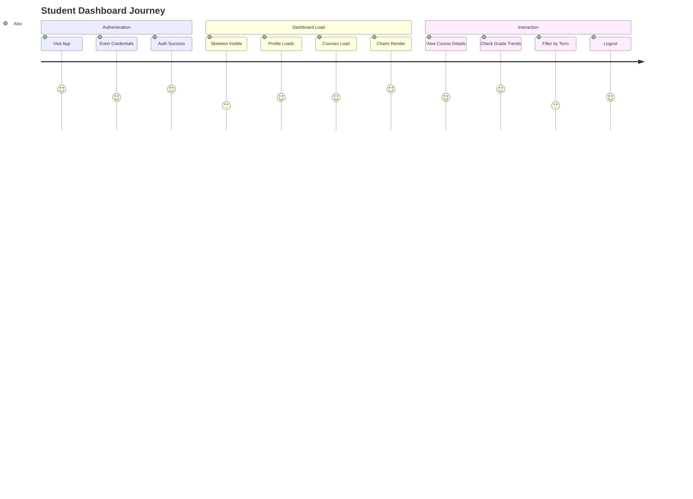

# Student Progress Tracking SaaS - Detailed Product Requirements Document

**Document Version:** 1.0  
**Last Updated:** 2024  
**Project Code:** SPTS-2024  
**Classification:** Internal - Development Team

---

## Table of Contents

1. [Executive Summary](#1-executive-summary)
2. [Product Vision & Strategy](#2-product-vision--strategy)
3. [User Personas & Journeys](#3-user-personas--journeys)
4. [Functional Requirements](#4-functional-requirements)
5. [Non-Functional Requirements](#5-non-functional-requirements)
6. [Technical Architecture](#6-technical-architecture)
7. [UI/UX Specification](#7-uiux-specification)
8. [Data Models & API Contracts](#8-data-models--api-contracts)
9. [Implementation Phases & Milestones](#9-implementation-phases--milestones)
10. [Risk Assessment & Mitigation](#10-risk-assessment--mitigation)
11. [Testing Strategy](#11-testing-strategy)
12. [Deployment & Operations](#12-deployment--operations)
13. [Appendices](#13-appendices)

---

## 1. Executive Summary

### 1.1 Project Overview

The **Student Progress Tracking SaaS** is a responsive single-page application
(SPA) that provides students with a centralized dashboard to monitor their
academic progress across enrolled courses. The platform aggregates course
completion percentages, grade analytics, and upcoming deadlines into an
intuitive, visually-rich interface accessible on all device sizes.

### 1.2 Business Objectives

| Objective                | Success Metric           | Target          |
| ------------------------ | ------------------------ | --------------- |
| **Student Engagement**   | Daily Active Users (DAU) | 60% of enrolled |
| **Data Visibility**      | Dashboard load time      | < 2s (P95)      |
| **Platform Reliability** | Uptime                   | 99.9%           |
| **Accessibility**        | WCAG 2.1 AA compliance   | 100%            |
| **Developer Velocity**   | Feature cycle time       | < 2 weeks       |

### 1.3 Scope Boundaries

| In Scope                                    | Out of Scope                |
| ------------------------------------------- | --------------------------- |
| Student authentication & session management | Instructor/admin dashboards |
| Course progress visualization               | Payment processing          |
| Grade charts (bar, doughnut, line)          | Real-time collaboration     |
| Responsive design (mobile to desktop)       | Video conferencing          |
| Mock API integration                        | Notification system         |
| Client-side data persistence                | Multi-language support      |
| Error handling & loading states             | Certificate generation      |
| Public deployment                           | AI-powered insights         |

---

## 2. Product Vision & Strategy

### 2.1 Vision Statement

> "Empower every learner with instant, visual insight into their academic
> journey—so they can focus on learning, not tracking."

### 2.2 Design Principles

1. **Clarity First** — Information hierarchy prioritizes actionable data
2. **Progressive Disclosure** — Overview → Detail on demand
3. **Responsive by Default** — Mobile-first, enhance upward
4. **Graceful Degradation** — Works without JavaScript (core content)
5. **Performance Budget** — < 100KB JS gzipped, < 3s TTI on 3G

### 2.3 Competitive Landscape & Inspiration

| Platform              | Strengths             | Gaps We Address                 |
| --------------------- | --------------------- | ------------------------------- |
| **Canvas LMS**        | Comprehensive         | Overwhelming UI, slow mobile    |
| **Coursera**          | Clean progress rings  | Limited grade analytics         |
| **Khan Academy**      | Mastery visualization | No cross-course view            |
| **Notion (Academic)** | Flexible              | No structured progress tracking |

**Our Differentiator:** Single-page, lightweight, visualization-first, works
offline-first with localStorage sync.

---

## 3. User Personas & Journeys

### 3.1 Primary Personas

#### **Alex - The Bootcamp Student** (Primary)

- **Age:** 26 | **Context:** 12-week full-stack bootcamp
- **Goals:** Track module completion, see quiz averages, know what's due
- **Pain Points:** Multiple platforms (GitHub, LMS, Slack), no unified view
- **Devices:** MacBook Pro (primary), iPhone (commute)
- **Tech Comfort:** High

#### **Priya - The Part-Time Learner** (Secondary)

- **Age:** 34 | **Context:** Evening certification while working full-time
- **Goals:** Quick progress check on phone, see weekly trends
- **Pain Points:** Limited time, fragmented attention, needs glanceable UI
- **Devices:** Android phone (primary), work laptop (restricted)
- **Tech Comfort:** Medium

#### **Marcus - The Academic Coordinator** (Trainer** (Tertiary)

- **Age:** 42 | **Context:** Reviews cohort progress weekly
- **Goals:** Identify at-risk students, export reports
- **Pain Points:** Manual spreadsheet compilation
- **Devices:** Desktop only
- **Tech Comfort:** Low-Medium

### 3.2 Core User Journey



### 3.3 Key User Flows

| Flow ID    | Flow Name          | Entry Point            | Exit Criteria                               |
| ---------- | ------------------ | ---------------------- | ------------------------------------------- |
| **UF-001** | First-Time Login   | `/` (unauthenticated)  | Redirected to `/dashboard` with data loaded |
| **UF-002** | Returning Session  | `/` (authenticated)    | Dashboard renders < 1s from cache           |
| **UF-003** | Course Deep Dive   | Course card click      | Modal/detail view shows module breakdown    |
| **UF-004** | Grade Analysis     | Chart interaction      | Tooltip/detail shows assignment-level data  |
| **UF-005** | Mobile Quick Check | `/dashboard` on mobile | Key metrics visible without scroll          |
| **UF-006** | Session Expiry     | Any protected route    | Redirected to `/login` with toast notice    |
| **UF-007** | Network Failure    | Any API call           | Retry button + cached data shown            |

---

## 4. Functional Requirements

### 4.1 Authentication Module (FR-AUTH)

| ID              | Requirement                                  | Priority | Acceptance Criteria                                         |
| --------------- | -------------------------------------------- | -------- | ----------------------------------------------------------- |
| **FR-AUTH-001** | User can log in with email/password          | Must     | Valid credentials → token stored → redirect to dashboard    |
| **FR-AUTH-002** | Invalid credentials show error               | Must     | 401 response → "Invalid email or password" toast            |
| **FR-AUTH-003** | Session persists across browser refresh      | Must     | localStorage token valid → auto-login → dashboard           |
| **FR-AUTH-004** | Session persists across tab close (optional) | Should   | "Remember me" → 30-day expiry vs session-only               |
| **FR-AUTH-005** | Protected routes redirect to login           | Must     | Unauthenticated `/dashboard` → `/login?redirect=/dashboard` |
| **FR-AUTH-006** | User can log out                             | Must     | Click avatar → "Logout" → clear storage → `/login`          |
| **FR-AUTH-007** | Expired token handled gracefully             | Must     | 401 on API → clear storage → redirect + toast               |
| **FR-AUTH-008** | Demo credentials visible on login            | Could    | "Demo: student@demo.com / demo123" shown                    |

### 4.2 Dashboard - Student Profile (FR-DASH-PROFILE)

| ID              | Requirement                            | Priority | Acceptance Criteria                                        |
| --------------- | -------------------------------------- | -------- | ---------------------------------------------------------- |
| **FR-DASH-001** | Display student name, email, avatar    | Must     | Data from `/api/students/:id` renders correctly            |
| **FR-DASH-002** | Show overall completion percentage     | Must     | Calculated from all courses: `Σ(completed)/Σ(total) * 100` |
| **FR-DASH-003** | Display student ID and enrollment date | Should   | Metadata visible in profile card                           |
| **FR-DASH-004** | Show current learning streak (days)    | Could    | Consecutive days with activity > 0                         |
| **FR-DASH-005** | Avatar fallback to initials            | Must     | No image → colored circle with initials                    |

### 4.3 Dashboard - Course Progress Cards (FR-DASH-COURSES)

| ID              | Requirement                                         | Priority | Acceptance Criteria                                       |
| --------------- | --------------------------------------------------- | -------- | --------------------------------------------------------- |
| **FR-DASH-010** | Display course cards in responsive grid             | Must     | 1 col (<640px), 2 col (640-1024px), 3 col (>1024px)       |
| **FR-DASH-011** | Each card shows: title, instructor, thumbnail       | Must     | All fields from API render without truncation             |
| **FR-DASH-012** | Animated progress bar (0-100%)                      | Must     | CSS animation on mount, respects `prefers-reduced-motion` |
| **FR-DASH-013** | Show "X/Y modules completed"                        | Must     | Fraction format, updates on data change                   |
| **FR-DASH-014** | Status badge: Not Started / In Progress / Completed | Must     | Color-coded: gray / blue / green                          |
| **FR-DASH-015** | Display current grade average                       | Should   | "87.5% (B+)" format with letter grade                     |
| **FR-DASH-016** | Show next upcoming module                           | Could    | "Next: Module 14 - React Hooks"                           |
| **FR-DASH-017** | Card hover/tap shows subtle elevation               | Should   | Desktop: shadow + transform; Mobile: active state         |
| **FR-DASH-018** | Empty state when no courses                         | Must     | "No courses yet" + "Browse Catalog" CTA (mock)            |
| **FR-DASH-019** | Skeleton loaders during fetch                       | Must     | Gray pulses matching card layout                          |

### 4.4 Dashboard - Grade Visualizations (FR-DASH-GRADES)

| ID              | Requirement                                      | Priority | Acceptance Criteria                                        |
| --------------- | ------------------------------------------------ | -------- | ---------------------------------------------------------- |
| **FR-DASH-020** | Bar Chart: Quiz/Assignment Scores                | Must     | X: assessment names, Y: score %, colored bars              |
| **FR-DASH-021** | Doughnut Chart: Grade Distribution               | Must     | Segments: A/B/C/D/F counts, legend clickable               |
| **FR-DASH-022** | Line Chart: Weekly Progress Trend                | Must     | X: weeks 1-12, Y: cumulative %, multi-line per course      |
| **FR-DASH-023** | Charts responsive: resize on container change    | Must     | `chart.resize()` on window resize, aspect-ratio maintained |
| **FR-DASH-024** | Tooltips show exact values on hover/tap          | Must     | "Quiz 3: 92/100 (92%)" format                              |
| **FR-DASH-025** | Legend toggle shows/hides dataset                | Should   | Click legend item → dataset opacity 0/1                    |
| **FR-DASH-026** | Loading skeleton for each chart                  | Must     | Gray placeholder with chart dimensions                     |
| **FR-DASH-027** | Error state: "Unable to load chart data" + retry | Must     | Button re-fetches that chart's data only                   |
| **FR-DASH-028** | Empty state: "No grade data available"           | Must     | When API returns empty arrays                              |
| **FR-DASH-029** | Keyboard navigable charts                        | Should   | Tab to chart → arrow keys navigate points                  |

### 4.5 API Integration (FR-API)

| ID             | Requirement                                    | Priority | Acceptance Criteria                                   |
| -------------- | ---------------------------------------------- | -------- | ----------------------------------------------------- |
| **FR-API-001** | Centralized API service with base URL config   | Must     | `api.get('/students/1')` works, env-configurable base |
| **FR-API-002** | Automatic auth header injection                | Must     | Token from storage → `Authorization: Bearer <token>`  |
| **FR-API-003** | Request timeout (10s default)                  | Must     | AbortController, toast "Request timed out"            |
| **FR-API-004** | Retry with exponential backoff (3x)            | Should   | Network error → wait 1s, 2s, 4s → then error          |
| **FR-API-005** | Global loading indicator for parallel requests | Must     | Spinner while any dashboard request pending           |
| **FR-API-006** | Request/response logging (dev only)            | Should   | `console.log('[API]', method, url, status)`           |
| **FR-API-007** | Mock API server for development                | Must     | JSON Server on `http://localhost:3001` with `db.json` |

### 4.6 Data Persistence (FR-STORAGE)

| ID              | Requirement                                  | Priority | Acceptance Criteria                          |
| --------------- | -------------------------------------------- | -------- | -------------------------------------------- |
| **FR-STOR-001** | Auth token in localStorage (30-day)          | Must     | Survives browser restart                     |
| **FR-STOR-002** | Auth token in sessionStorage (tab-only)      | Must     | Cleared on tab close                         |
| **FR-STOR-003** | Theme preference in localStorage             | Should   | `theme: 'light'                              | 'dark' | 'system'` |
| **FR-STOR-004** | Dashboard scroll position in sessionStorage  | Could    | Restore scroll on back navigation            |
| **FR-STOR-005** | Course filter/sort state in sessionStorage   | Could    | Persist during session                       |
| **FR-STOR-006** | Graceful degradation if storage full/blocked | Must     | Try/catch, fallback to memory-only, no crash |

### 4.7 Error Handling & UX (FR-ERROR)

| ID             | Requirement                                     | Priority | Acceptance Criteria                                   |
| -------------- | ----------------------------------------------- | -------- | ----------------------------------------------------- |
| **FR-ERR-001** | Toast notification system                       | Must     | Top-right (desktop), bottom-center (mobile)           |
| **FR-ERR-002** | Error toasts: red, dismissible, 5s auto-dismiss | Must     | "Unable to load courses. [Retry]"                     |
| **FR-ERR-003** | Success toasts: green, 3s auto-dismiss          | Should   | "Logged in successfully"                              |
| **FR-ERR-004** | Network offline detection                       | Must     | `navigator.onLine` listener → banner "You're offline" |
| **FR-ERR-005** | Automatic retry on reconnect                    | Should   | Queue failed requests, replay on online               |
| **FR-ERR-006** | Skeleton loaders for all async content          | Must     | No layout shift when data arrives                     |
| **FR-ERR-007** | Empty states with illustration + action         | Must     | "No courses" + "Browse Courses" button                |
| **FR-ERR-008** | 401 → auto-logout + redirect                    | Must     | Clear storage, toast "Session expired", go to login   |
| **FR-ERR-009** | 404/500 → generic error + retry                 | Must     | "Something went wrong. [Try Again]"                   |

### 4.8 Responsive Design (FR-RESP)

| ID              | Requirement                              | Priority | Acceptance Criteria                                  |
| --------------- | ---------------------------------------- | -------- | ---------------------------------------------------- |
| **FR-RESP-001** | Mobile-first CSS (min-width breakpoints) | Must     | Base styles < 640px, then `sm:`, `md:`, `lg:`, `xl:` |
| **FR-RESP-002** | Breakpoints: 640, 768, 1024, 1280, 1536  | Must     | Tailwind default breakpoints                         |
| **FR-RESP-003** | Touch targets ≥ 44×44px                  | Must     | Buttons, links, interactive elements                 |
| **FR-RESP-004** | Hamburger menu on mobile (< 768px)       | Must     | Slide-in drawer, focus trap, ESC closes              |
| **FR-RESP-005** | Charts stack vertically on mobile        | Must     | Single column, full width                            |
| **FR-RESP-006** | Tables → cards on mobile                 | Should   | Course grid becomes stacked cards                    |
| **FR-RESP-007** | Font scaling: clamp(1rem, 2vw, 1.25rem)  | Should   | Fluid typography                                     |
| **FR-RESP-008** | No horizontal overflow                   | Must     | `overflow-x: hidden` on body, containers             |

### 4.9 Deployment (FR-DEPLOY)

| ID             | Requirement                             | Priority | Acceptance Criteria                            |
| -------------- | --------------------------------------- | -------- | ---------------------------------------------- |
| **FR-DEP-001** | Deploy to Vercel/Netlify/GitHub Pages   | Must     | Public URL accessible                          |
| **FR-DEP-002** | SPA fallback (rewrites to index.html)   | Must     | Direct route access works                      |
| **FR-DEP-003** | Environment variables for API URL       | Must     | `VITE_API_URL` injected at build               |
| **FR-DEP-004** | Production build minifies JS/CSS        | Must     | Terser + cssnano, source maps                  |
| **FR-DEP-005** | Cache-Control headers for static assets | Should   | `max-age=31536000, immutable` for hashed files |
| **FR-DEP-006** | CI/CD pipeline on GitHub Actions        | Must     | Lint → Test → Build → Deploy on push to main   |

---

## 5. Non-Functional Requirements

### 5.1 Performance

| Metric                             | Target   | Measurement               |
| ---------------------------------- | -------- | ------------------------- |
| **First Contentful Paint (FCP)**   | < 1.5s   | Lighthouse CI             |
| **Largest Contentful Paint (LCP)** | < 2.5s   | Lighthouse CI             |
| **Time to Interactive (TTI)**      | < 3.5s   | Lighthouse CI             |
| **Total Blocking Time (TBT)**      | < 200ms  | Lighthouse CI             |
| **Cumulative Layout Shift (CLS)**  | < 0.1    | Lighthouse CI             |
| **JS Bundle Size (gzipped)**       | < 100 KB | `webpack-bundle-analyzer` |
| **API Response Time (P95)**        | < 500ms  | Mock server latency sim   |

### 5.2 Accessibility (WCAG 2.1 AA)

| Criterion                      | Implementation                                                           |
| ------------------------------ | ------------------------------------------------------------------------ |
| **1.1.1 Non-text Content**     | All images have `alt`, charts have ARIA labels + data tables             |
| **1.3.1 Info & Relationships** | Semantic HTML: `<header>`, `<main>`, `<section>`, `<article>`, `<aside>` |
| **1.4.3 Contrast (Minimum)**   | 4.5:1 text, 3:1 UI elements (verified with axe-core)                     |
| **2.1.1 Keyboard**             | All interactive elements reachable, visible focus rings                  |
| **2.4.3 Focus Order**          | Logical tab order matches visual layout                                  |
| **2.4.7 Focus Visible**        | `:focus-visible` rings on all interactive elements                       |
| **3.2.1 On Focus**             | No unexpected context changes on focus                                   |
| **4.1.2 Name, Role, Value**    | Custom components expose proper ARIA roles                               |

### 5.3 Security

| Requirement             | Implementation                                                                                          |
| ----------------------- | ------------------------------------------------------------------------------------------------------- |
| **XSS Prevention**      | No `innerHTML` with user data, DOMPurify for any dynamic HTML                                           |
| **CSP Headers**         | `script-src 'self' 'unsafe-inline' cdn.jsdelivr.net; style-src 'self' 'unsafe-inline' cdn.jsdelivr.net` |
| **Token Storage**       | HttpOnly cookies preferred (mock: localStorage with expiry check)                                       |
| **HTTPS Only**          | Enforced in production via platform (Vercel/Netlify)                                                    |
| **Dependency Scanning** | `npm audit` in CI, Dependabot alerts                                                                    |

### 5.4 Browser Support

| Browser        | Minimum Version | Support Level |
| -------------- | --------------- | ------------- |
| Chrome         | 90+             | Full          |
| Firefox        | 88+             | Full          |
| Safari         | 14+             | Full          |
| Edge           | 90+             | Full          |
| Mobile Safari  | iOS 14+         | Full          |
| Chrome Android | 90+             | Full          |

### 5.5 Maintainability

| Metric                     | Target                                    |
| -------------------------- | ----------------------------------------- |
| **Cyclomatic Complexity**  | < 10 per function                         |
| **File Length**            | < 300 lines                               |
| **Test Coverage**          | > 80% (unit), > 60% (integration)         |
| **Documentation Coverage** | All public functions JSDoc                |
| **Dependency Freshness**   | No critical CVEs, major updates quarterly |

---

## 6. Technical Architecture

### 6.1 High-Level Architecture

```
┌─────────────────────────────────────────────────────────────────┐
│                        Browser (Client)                          │
├─────────────────────────────────────────────────────────────────┤
│  ┌──────────┐  ┌──────────┐  ┌──────────┐  ┌────────────────┐  │
│  │  Router  │  │  State   │  │  Views   │  │  Components    │  │
│  │ (Hash)   │◄─┤ (Context)│◄─┤ (Pages)  │◄─┤ (UI Primitives)│  │
│  └──────────┘  └──────────┘  └──────────┘  └────────────────┘  │
│         │            │            │              │              │
│         ▼            ▼            ▼              ▼              │
│  ┌──────────────────────────────────────────────────────────┐  │
│  │                      Services Layer                       │  │
│  │  ┌─────────┐  ┌──────────┐  ┌─────────┐  ┌────────────┐  │  │
│  │  │   API   │  │ Storage  │  │ Charts  │  │ Notify     │  │  │
│  │  │ Service │  │ Service  │  │ Service │  │ Service    │  │  │
│  │  └─────────┘  └──────────┘  └─────────┘  └────────────┘  │  │
│  └──────────────────────────────────────────────────────────┘  │
│         │            │            │              │              │
│         ▼            ▼            ▼              ▼              │
│  ┌──────────────────────────────────────────────────────────┐  │
│  │                      Browser APIs                          │  │
│  │  fetch  │  localStorage  │  sessionStorage  │  Chart.js   │  │
│  └──────────────────────────────────────────────────────────┘  │
└─────────────────────────────────────────────────────────────────┘
                              │
                              ▼
┌─────────────────────────────────────────────────────────────────┐
│                     Mock Backend (Dev)                          │
│  ┌─────────────────┐    ┌─────────────────┐                    │
│  │   JSON Server   │    │  Express Mock   │  (Alternative)     │
│  │  (Port 3001)    │    │  (Port 3001)    │                    │
│  └─────────────────┘    └─────────────────┘                    │
└─────────────────────────────────────────────────────────────────┘
```

### 6.2 Technology Stack Decisions

| Category     | Choice                              | Rationale                                               |
| ------------ | ----------------------------------- | ------------------------------------------------------- |
| **Language** | Vanilla JS (ES2022+)                | Zero build complexity, universal skills, fast iteration |
| **Styling**  | Tailwind CSS (CDN)                  | Utility-first, responsive built-in, no config for CDN   |
| **Charts**   | Chart.js v4 (CDN)                   | Canvas-based, performant, tree-shakeable, good a11y     |
| **Icons**    | Lucide (CDN)                        | Lightweight, consistent, tree-shakeable                 |
| **Routing**  | Custom hash router                  | Zero deps, works on static hosting, simple mental model |
| **State**    | Context + PubSub                    | Lightweight, React-like pattern, no Redux boilerplate   |
| **Build**    | esbuild (dev), custom script (prod) | 10-100x faster than webpack, single config file         |
| **Testing**  | Vitest (unit), Playwright (e2e)     | Fast, modern, good DX                                   |
| **Linting**  | ESLint + Prettier                   | Standard, auto-fixable                                  |
| **CI/CD**    | GitHub Actions                      | Native, free for public, matrix support                 |

### 6.3 Data Flow Patterns

#### **Authentication Flow**

```
User Input → Validation → API Login → Token Response
    │                                           │
    ▼                                           ▼
Error Toast ←───────────────┐            Store Tokens
                            │                │
                            ▼                ▼
                      Redirect to      Hydrate Auth Context
                      /dashboard           │
                                           ▼
                                    Fetch Dashboard Data
```

#### **Dashboard Data Flow**

```
Route Mount → Auth Guard → Parallel Fetch
    │                              │
    │         ┌────────┬────────┬──┴────────┐
    │         ▼        ▼        ▼           ▼
    │      Profile   Courses  Grades    (Error Boundary)
    │         │        │        │           │
    ▼         ▼        ▼        ▼           ▼
Render    Profile   Course   Charts    Toast/Empty
         Card      Grid                 State
```

### 6.4 State Management Architecture

```javascript
// AuthContext.js - Singleton pattern
const AuthContext = {
    state: { user: null, token: null, isAuthenticated: false },
    subscribers: new Set(),

    subscribe(fn) {
        this.subscribers.add(fn);
        return () => this.subscribers.delete(fn);
    },
    notify() {
        this.subscribers.forEach(fn => fn(this.state));
    },

    login(credentials) {
        /* ... */
    },
    logout() {
        /* ... */
    },
    restoreSession() {
        /* ... */
    },
};
```

**Principles:**

- Single source of truth per domain
- Immutable state updates
- Subscription-based reactivity (no Proxy complexity)
- DevTools logging in development

---

## 7. UI/UX Specification

### 7.1 Design System

#### **Color Palette**

| Role              | Light Mode              | Dark Mode               | Usage                       |
| ----------------- | ----------------------- | ----------------------- | --------------------------- |
| **Primary**       | `#2563eb` (blue-600)    | `#3b82f6` (blue-500)    | CTAs, links, progress bars  |
| **Primary Hover** | `#1d4ed8` (blue-700)    | `#60a5fa` (blue-400)    | Button hover                |
| **Secondary**     | `#64748b` (slate-500)   | `#94a3b8` (slate-400)   | Muted text, borders         |
| **Success**       | `#059669` (emerald-600) | `#10b981` (emerald-500) | Completed status, positive  |
| **Warning**       | `#d97706` (amber-600)   | `#f59e0b` (amber-500)   | In-progress, pending        |
| **Error**         | `#dc2626` (red-600)     | `#ef4444` (red-500)     | Errors, destructive actions |
| **Background**    | `#f8fafc` (slate-50)    | `#0f172a` (slate-950)   | Page background             |
| **Surface**       | `#ffffff` (white)       | `#1e293b` (slate-800)   | Cards, modals               |
| **Border**        | `#e2e8f0` (slate-200)   | `#334155` (slate-700)   | Dividers, input borders     |
| **Text Primary**  | `#0f172a` (slate-900)   | `#f1f5f9` (slate-100)   | Headings, body              |
| **Text Muted**    | `#64748b` (slate-500)   | `#94a3b8` (slate-400)   | Secondary info              |

#### **Typography**

| Element        | Font           | Size                            | Weight | Line Height |
| -------------- | -------------- | ------------------------------- | ------ | ----------- |
| **Display**    | Inter          | `clamp(2rem, 5vw, 3rem)`        | 700    | 1.1         |
| **H1**         | Inter          | `clamp(1.5rem, 3vw, 2rem)`      | 700    | 1.2         |
| **H2**         | Inter          | `clamp(1.25rem, 2.5vw, 1.5rem)` | 600    | 1.3         |
| **H3**         | Inter          | `1.125rem`                      | 600    | 1.4         |
| **Body**       | Inter          | `1rem`                          | 400    | 1.6         |
| **Body Small** | Inter          | `0.875rem`                      | 400    | 1.5         |
| **Caption**    | Inter          | `0.75rem`                       | 500    | 1.4         |
| **Code**       | JetBrains Mono | `0.875em`                       | 400    | 1.5         |

#### **Spacing Scale** (Tailwind Default)

| Token      | Value            | Usage              |
| ---------- | ---------------- | ------------------ |
| `space-1`  | `0.25rem` (4px)  | Tight gaps         |
| `space-2`  | `0.5rem` (8px)   | Small gaps         |
| `space-3`  | `0.75rem` (12px) | Medium gaps        |
| `space-4`  | `1rem` (16px)    | Standard gaps      |
| `space-6`  | `1.5rem` (24px)  | Section gaps       |
| `space-8`  | `2rem` (32px)    | Large section gaps |
| `space-12` | `3rem` (48px)    | Page sections      |

#### **Border Radius**

| Token          | Value            | Usage                  |
| -------------- | ---------------- | ---------------------- |
| `rounded-sm`   | `0.125rem` (2px) | Badges, small elements |
| `rounded-md`   | `0.375rem` (6px) | Buttons, inputs        |
| `rounded-lg`   | `0.5rem` (8px)   | Cards, modals          |
| `rounded-xl`   | `0.75rem` (12px) | Large cards            |
| `rounded-full` | `9999px`         | Avatars, pills         |

#### **Shadows**

| Token       | Value                               | Usage              |
| ----------- | ----------------------------------- | ------------------ |
| `shadow-sm` | `0 1px 2px 0 rgb(0 0 0 / 0.05)`     | Subtle elevation   |
| `shadow-md` | `0 4px 6px -1px rgb(0 0 0 / 0.1)`   | Cards, dropdowns   |
| `shadow-lg` | `0 10px 15px -3px rgb(0 0 0 / 0.1)` | Modals, drawers    |
| `shadow-xl` | `0 20px 25px -5px rgb(0 0 0 / 0.1)` | Tooltips, popovers |

### 7.2 Component Specifications

#### **Button Variants**

| Variant         | Background       | Text               | Border               | Usage             |
| --------------- | ---------------- | ------------------ | -------------------- | ----------------- |
| **Primary**     | `bg-primary-600` | `text-white`       | none                 | Main CTAs         |
| **Secondary**   | `bg-slate-100`   | `text-slate-900`   | `border-slate-300`   | Secondary actions |
| **Outline**     | `transparent`    | `text-primary-600` | `border-primary-600` | Tertiary          |
| **Ghost**       | `transparent`    | `text-slate-600`   | none                 | Subtle actions    |
| **Destructive** | `bg-red-600`     | `text-white`       | none                 | Delete, logout    |

**States:** `hover:`, `focus-visible:`, `active:`, `disabled:` (opacity-50,
cursor-not-allowed)

#### **Input Fields**

```
┌─────────────────────────────────────────┐
│ Label (required)                        │
├─────────────────────────────────────────┤
│ [Email address                    ]  ▼  │  ◄ focus: ring-2 ring-primary-500
└─────────────────────────────────────────┘
│ Helper text / Error message (text-sm)   │
└─────────────────────────────────────────┘
```

#### **Course Card**

```
┌─────────────────────────────────────────┐
│ ┌─────────────────────────────────────┐ │
│ │        Thumbnail (16:9)             │ │
│ └─────────────────────────────────────┘ │
├─────────────────────────────────────────┤
│ Course Title                    [Badge] │
│ Instructor Name                       │
├─────────────────────────────────────────┤
│ ████████████░░░░░░░░░░  65%             │
│ 13/20 modules completed                │
├─────────────────────────────────────────┤
│ Grade: 87.5% (B+)    Next: Module 14   │
└─────────────────────────────────────────┘
```

### 7.3 Responsive Breakpoint Behavior

| Component         | < 640px              | 640-1023px            | ≥ 1024px        |
| ----------------- | -------------------- | --------------------- | --------------- |
| **Navigation**    | Hamburger drawer     | Horizontal, condensed | Full horizontal |
| **Course Grid**   | 1 column             | 2 columns             | 3 columns       |
| **Chart Layout**  | Stacked (100% width) | 2-col grid            | 2-col + 1 full  |
| **Profile Card**  | Full width, centered | Full width            | Max-w-md, left  |
| **Typography**    | Base scale           | Base scale            | Base scale + 1  |
| **Touch Targets** | 48×48px min          | 44×44px min           | 44×44px min     |

### 7.4 Animation & Motion

| Animation           | Duration | Easing           | Reduced Motion |
| ------------------- | -------- | ---------------- | -------------- |
| **Page Transition** | 150ms    | `ease-out`       | None (instant) |
| **Card Hover**      | 200ms    | `ease-out`       | None           |
| **Progress Bar**    | 750ms    | `ease-out-quart` | Instant        |
| **Chart Render**    | 750ms    | `ease-out-quart` | Instant        |
| **Toast Enter**     | 300ms    | `ease-out-back`  | Fade only      |
| **Modal/Drawer**    | 200ms    | `ease-out`       | Fade only      |

**Respect `prefers-reduced-motion`:** All animations disabled via
`@media (prefers-reduced-motion: reduce)`.

---

## 8. Data Models & API Contracts

### 8.1 Core Data Models

#### **Student**

```typescript
interface Student {
    id: string; // "stu_001"
    name: string; // "Alex Johnson"
    email: string; // "alex@student.edu"
    avatarUrl?: string; // "https://..." or null
    studentId: string; // "STU-2024-001"
    enrolledAt: string; // "2024-01-15T00:00:00Z"
    overallProgress: number; // 0-100 (calculated)
    currentStreak: number; // days
    lastActiveAt: string; // "2024-01-20T14:30:00Z"
}
```

#### **Course**

```typescript
interface Course {
    id: string; // "course_001"
    title: string; // "Full Stack Web Development"
    instructor: string; // "Dr. Sarah Chen"
    thumbnailUrl: string; // "https://..."
    description: string;
    totalModules: number; // 20
    completedModules: number; // 13
    progress: number; // 0-100 (calculated)
    status: 'not-started' | 'in-progress' | 'completed';
    currentGrade: number; // 87.5
    letterGrade: 'A+' | 'A' | 'A-' | 'B+' | 'B' | 'B-' | 'C+' | 'C' | 'D' | 'F';
    nextModule?: {
        id: string;
        title: string;
        dueDate?: string;
    };
    lastAccessedAt: string; // "2024-01-19T10:00:00Z"
    term: string; // "Spring 2024"
}
```

#### **Grade Data (for Charts)**

```typescript
interface QuizScore {
    id: string; // "quiz_001"
    label: string; // "Quiz 1: HTML Basics"
    score: number; // 85
    maxScore: number; // 100
    percentage: number; // 85
    completedAt: string; // "2024-01-10T12:00:00Z"
    courseId: string; // "course_001"
}

interface GradeDistribution {
    grade: 'A' | 'B' | 'C' | 'D' | 'F';
    count: number;
    percentage: number; // of total assignments
}

interface WeeklyProgress {
    week: number; // 1-12
    dateRange: string; // "Jan 8 - Jan 14"
    courses: Record<string, number>; // { "course_001": 15, "course_002": 8 }
    cumulative: number; // overall %
}
```

### 8.2 API Endpoints

#### **Authentication**

| Method | Endpoint          | Request                            | Response (200)                        | Errors   |
| ------ | ----------------- | ---------------------------------- | ------------------------------------- | -------- |
| `POST` | `/api/auth/login` | `{ email, password, rememberMe? }` | `{ token, expiresAt, user: Student }` | 400, 401 |

#### **Student Data**

| Method | Endpoint                    | Response (200)                                                                                     | Errors   |
| ------ | --------------------------- | -------------------------------------------------------------------------------------------------- | -------- |
| `GET`  | `/api/students/:id`         | `Student`                                                                                          | 401, 404 |
| `GET`  | `/api/students/:id/courses` | `Course[]`                                                                                         | 401, 404 |
| `GET`  | `/api/students/:id/grades`  | `{ quizScores: QuizScore[], distribution: GradeDistribution[], weeklyProgress: WeeklyProgress[] }` | 401, 404 |

#### **Course Details**

| Method | Endpoint                    | Response (200)                  | Errors   |
| ------ | --------------------------- | ------------------------------- | -------- |
| `GET`  | `/api/courses/:id`          | `Course` + modules[]            | 401, 404 |
| `GET`  | `/api/courses/:id/progress` | `{ modules: ModuleProgress[] }` | 401, 404 |

### 8.3 Mock Data Structure (`mock-api/db.json`)

```json
{
    "students": [
        {
            "id": "stu_001",
            "name": "Alex Johnson",
            "email": "alex@student.edu",
            "password": "demo123",
            "avatarUrl": "https://api.dicebear.com/7.x/avataaars/svg?seed=alex",
            "studentId": "STU-2024-001",
            "enrolledAt": "2024-01-15T00:00:00Z"
        }
    ],
    "courses": [
        {
            "id": "course_001",
            "studentId": "stu_001",
            "title": "Full Stack Web Development",
            "instructor": "Dr. Sarah Chen",
            "thumbnailUrl": "https://picsum.photos/seed/course1/400/225",
            "description": "Complete web development bootcamp",
            "totalModules": 20,
            "completedModules": 13,
            "status": "in-progress",
            "currentGrade": 87.5,
            "term": "Spring 2024",
            "lastAccessedAt": "2024-01-19T10:00:00Z"
        }
    ],
    "quizScores": [
        {
            "id": "q_001",
            "studentId": "stu_001",
            "courseId": "course_001",
            "label": "Quiz 1: HTML Basics",
            "score": 90,
            "maxScore": 100,
            "completedAt": "2024-01-10T12:00:00Z"
        }
    ],
    "gradeDistribution": [
        { "grade": "A", "count": 5, "percentage": 35 },
        { "grade": "B", "count": 6, "percentage": 42 },
        { "grade": "C", "count": 2, "percentage": 14 },
        { "grade": "D", "count": 1, "percentage": 7 },
        { "grade": "F", "count": 0, "percentage": 0 }
    ],
    "weeklyProgress": [
        {
            "week": 1,
            "dateRange": "Jan 8-14",
            "courses": { "course_001": 10 },
            "cumulative": 10
        },
        {
            "week": 2,
            "dateRange": "Jan 15-21",
            "courses": { "course_001": 25 },
            "cumulative": 25
        }
    ]
}
```

---

## 9. Implementation Phases & Milestones

### 9.1 Phase Breakdown

| Phase       | Duration | Focus                 | Deliverables                                        |
| ----------- | -------- | --------------------- | --------------------------------------------------- |
| **Phase 0** | Week 1   | **Foundation**        | Repo, CI/CD, linting, dev server, mock API          |
| **Phase 1** | Week 2   | **Authentication**    | Login, session, protected routes, logout            |
| **Phase 2** | Week 3   | **Core Layout**       | Header, navigation, responsive shell, routing       |
| **Phase 3** | Week 4   | **Profile + Courses** | Profile card, course grid, progress bars, skeletons |
| **Phase 4** | Week 5   | **Charts & Grades**   | Chart.js integration, 3 chart types, responsiveness |
| **Phase 5** | Week 6   | **Polish & Harden**   | Error handling, toasts, empty states, a11y, testing |
| **Phase 6** | Week 7   | **Deploy & Document** | Production deploy, README, handoff docs             |

### 9.2 Milestone Gates

| Gate                     | Criteria                                          | Owner           |
| ------------------------ | ------------------------------------------------- | --------------- |
| **M0: Repo Ready**       | CI passes, dev server runs, mock API responds     | Tech Lead       |
| **M1: Auth Complete**    | Login/logout works, session persists, guards work | Auth Owner      |
| **M2: Shell Ready**      | Responsive layout, routing, navigation works      | UI Owner        |
| **M3: Dashboard MVP**    | Profile + courses + charts render with mock data  | Dashboard Owner |
| **M4: Production Ready** | All tests pass, Lighthouse > 90, deployed         | Tech Lead       |

### 9.3 Team Role Assignment

| Role                   | Responsibilities                                  | Primary Phases |
| ---------------------- | ------------------------------------------------- | -------------- |
| **Tech Lead**          | Architecture, CI/CD, code review, blockers        | All            |
| **Auth Engineer**      | Login, tokens, guards, storage                    | 0, 1, 5        |
| **UI Engineer**        | Layout, components, responsive, design system     | 0, 2, 3, 5     |
| **Dashboard Engineer** | Profile, courses, data fetching, state            | 2, 3, 4, 5     |
| **Charts Engineer**    | Chart.js configs, data transforms, responsiveness | 4, 5           |
| **QA Engineer**        | Test plans, e2e, a11y audit, performance          | 3, 4, 5, 6     |

---

## 10. Risk Assessment & Mitigation

### 10.1 Technical Risks

| Risk                                             | Likelihood | Impact | Mitigation                                                             |
| ------------------------------------------------ | ---------- | ------ | ---------------------------------------------------------------------- |
| **Chart.js bundle size**                         | Medium     | High   | Use tree-shaking, only import needed controllers, lazy-load charts     |
| **localStorage quota exceeded**                  | Low        | High   | Wrap in try/catch, fallback to memory, warn user                       |
| **Mobile touch scrolling conflicts with charts** | Medium     | Medium | `touch-action: manipulation` on chart containers, test on real devices |
| **Mock API doesn't match real backend**          | High       | Medium | Define OpenAPI spec, generate mock from spec                           |
| **CSS specificity wars with Tailwind**           | Medium     | Low    | Use `@layer components`, avoid `@apply` overuse                        |
| **Hash router SEO limitations**                  | Low        | Low    | Acceptable for authenticated SPA; add meta tags                        |

### 10.2 Schedule Risks

| Risk                               | Likelihood | Impact | Mitigation                                       |
| ---------------------------------- | ---------- | ------ | ------------------------------------------------ |
| **Chart integration takes longer** | Medium     | High   | Start Chart.js spike in Phase 0, allocate buffer |
| **Responsive edge cases**          | High       | Medium | Test on device farm (BrowserStack) weekly        |
| **Team member unavailable**        | Low        | High   | Cross-train, document decisions in ADRs          |

### 10.3 Quality Risks

| Risk                          | Likelihood | Impact | Mitigation                                       |
| ----------------------------- | ---------- | ------ | ------------------------------------------------ |
| **Accessibility regressions** | Medium     | High   | axe-core in CI, manual keyboard test each PR     |
| **Performance regression**    | Medium     | Medium | Lighthouse CI budgets, bundle size check         |
| **Memory leaks in Chart.js**  | Low        | High   | `chart.destroy()` on unmount, verify in devtools |

---

## 11. Testing Strategy

### 11.1 Test Pyramid

```
                    ┌─────────────┐
                    │   E2E (5)   │  ← Playwright: critical flows
                   ┌───────────────┐
                  │  Integration  │  ← Vitest: API + component combos
                 ┌───────────────────┐
                │     Unit (50+)    │  ← Vitest: utils, hooks, services
               └─────────────────────┘
```

### 11.2 Test Coverage Targets

| Layer             | Target            | Tools                        |
| ----------------- | ----------------- | ---------------------------- |
| **Unit**          | > 80%             | Vitest, @testing-library/dom |
| **Integration**   | > 60%             | Vitest, MSW                  |
| **E2E**           | 10 critical paths | Playwright                   |
| **Visual**        | Key components    | Playwright + pixelmatch      |
| **Accessibility** | 0 violations      | axe-core + Playwright        |
| **Performance**   | Budgets met       | Lighthouse CI                |

### 11.3 Critical E2E Scenarios

| Test ID     | Scenario                      | Steps                                                      |
| ----------- | ----------------------------- | ---------------------------------------------------------- |
| **E2E-001** | Happy path login → dashboard  | Visit `/` → redirect login → enter creds → dashboard loads |
| **E2E-002** | Session persistence           | Login → refresh → still on dashboard                       |
| **E2E-003** | Protected route guard         | Visit `/dashboard` unauth → redirect `/login`              |
| **E2E-004** | Logout flow                   | Dashboard → avatar menu → logout → login page              |
| **E2E-005** | Mobile navigation             | Resize to 375px → hamburger → menu opens → link works      |
| **E2E-006** | Chart responsiveness          | Load dashboard → resize window → charts resize             |
| **E2E-007** | Error handling                | Mock API 500 → toast appears → retry works                 |
| **E2E-008** | Offline behavior              | Disconnect network → banner shows → reconnect → retry      |
| **E2E-009** | Keyboard navigation           | Tab through entire dashboard → focus visible               |
| **E2E-010** | Theme toggle (if implemented) | Toggle theme → persists → applies on reload                |

---

## 12. Deployment & Operations

### 12.1 Deployment Pipeline

```yaml
# .github/workflows/deploy.yml
name: Deploy to Production
on:
    push:
        branches: [main]
    workflow_dispatch:

jobs:
    lint-test-build:
        runs-on: ubuntu-latest
        steps:
            - uses: actions/checkout@v4
            - uses: actions/setup-node@v4
              with: { node-version: '20', cache: 'npm' }
            - run: npm ci
            - run: npm run lint
            - run: npm run test:coverage
            - run: npm run build
            - uses: actions/upload-artifact@v4
              with: { name: dist, path: dist }

    deploy-vercel:
        needs: lint-test-build
        runs-on: ubuntu-latest
        steps:
            - uses: actions/download-artifact@v4
              with: { name: dist, path: dist }
            - uses: amondnet/vercel-action@v25
              with:
                  vercel-token: ${{ secrets.VERCEL_TOKEN }}
                  vercel-org-id: ${{ secrets.VERCEL_ORG_ID }}
                  vercel-project-id: ${{ secrets.VERCEL_PROJECT_ID }}
                  vercel-args: '--prod'
```

### 12.2 Environment Configuration

| Environment     | URL                           | API Base                          | Features                        |
| --------------- | ----------------------------- | --------------------------------- | ------------------------------- |
| **Development** | `http://localhost:5173`       | `http://localhost:3001/api`       | Mock API, hot reload, dev tools |
| **Preview**     | `https://pr-123.vercel.app`   | `https://api-staging.example.com` | Realistic data, no indexing     |
| **Production**  | `https://tracker.example.com` | `https://api.example.com`         | CDN, CSP, analytics             |

### 12.3 Monitoring & Observability

| Metric              | Tool                              | Alert Threshold       |
| ------------------- | --------------------------------- | --------------------- |
| **Uptime**          | Vercel/Netlify + UptimeRobot      | < 99.9%               |
| **Core Web Vitals** | Vercel Analytics / web-vitals lib | LCP > 2.5s, CLS > 0.1 |
| **JS Errors**       | Sentry (free tier)                | > 10 errors/min       |
| **API Latency**     | Custom timing + Sentry            | P95 > 1s              |
| **Bundle Size**     | GitHub Action + bundlesize        | > 120KB gzipped       |

---

## 13. Appendices

### 13.1 Glossary

| Term               | Definition                                                          |
| ------------------ | ------------------------------------------------------------------- |
| **SPA**            | Single Page Application - client-side routing, no full-page reloads |
| **JWT**            | JSON Web Token - stateless auth token with claims                   |
| **localStorage**   | Persistent browser storage (5-10MB, survives restart)               |
| **sessionStorage** | Tab-scoped storage (cleared on tab close)                           |
| **Tree Shaking**   | Dead code elimination during bundling                               |
| **SSR**            | Server-Side Rendering (not used in this project)                    |
| **CSR**            | Client-Side Rendering (this project's approach)                     |
| **PWA**            | Progressive Web App (future enhancement)                            |
| **MSW**            | Mock Service Worker - API mocking at network level                  |

### 13.2 Reference Implementations

- **Authentication Pattern:**
  [OWASP SPA Auth Cheatsheet](https://cheatsheetseries.owasp.org/cheatsheets/Authentication_Cheat_Sheet.html)
- **Chart.js Accessibility:**
  [Chart.js A11y Plugin](https://www.chartjs.org/docs/latest/developers/plugins.html#accessibility)
- **Vanilla JS State Management:**
  [TinyState Pattern](https://github.com/jaredpalmer/tiny-state)
- **Responsive Images:**
  [MDN Responsive Images](https://developer.mozilla.org/en-US/docs/Learn/HTML/Multimedia_and_embedding/Responsive_images)

### 13.3 Decision Log (ADRs)

| ADR     | Title                                               | Status   | Date    |
| ------- | --------------------------------------------------- | -------- | ------- |
| **001** | Use vanilla JS + CDN libraries over framework       | Accepted | 2024-01 |
| **002** | Hash-based routing for static hosting compatibility | Accepted | 2024-01 |
| **003** | Chart.js over Recharts/D3 for bundle size           | Accepted | 2024-01 |
| **004** | Dual token storage (local + session) for UX         | Accepted | 2024-01 |
| **005** | Tailwind via CDN for zero-config dev                | Accepted | 2024-01 |

### 13.4 Future Enhancement Backlog

| Priority | Feature                              | Effort  | Dependencies                 |
| -------- | ------------------------------------ | ------- | ---------------------------- |
| **P1**   | Dark mode toggle                     | 2 days  | Theme context, CSS variables |
| **P1**   | PDF export of progress report        | 3 days  | jsPDF, chart to image        |
| **P2**   | Course detail modal with module list | 3 days  | Course API expansion         |
| **P2**   | Push notifications (PWA)             | 1 week  | Service Worker, VAPID        |
| **P3**   | Instructor view (read-only)          | 1 week  | Role-based auth, new API     |
| **P3**   | AI study recommendations             | 2 weeks | ML service, user behavior    |
| **P4**   | Multi-language (i18n)                | 1 week  | i18next, translation files   |
| **P4**   | Real-time collaboration              | 3 weeks | WebSocket, backend           |

---

## Document Control

| Version | Date       | Author       | Changes              |
| ------- | ---------- | ------------ | -------------------- |
| 1.0     | 2024-01-15 | Product Team | Initial detailed PRD |

**Reviewers:** Tech Lead, UI Lead, QA Lead  
**Approval:** Required from all reviewers before Phase 1 kickoff  
**Next Review:** End of Phase 2 (Week 3)

---

_End of Detailed PRD_
